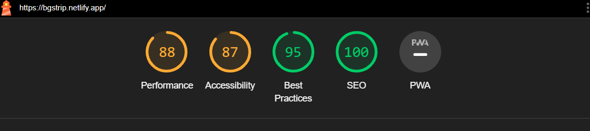

# BGSTRIP

BGSTRIP is a web application that utilizes the "remove.bg" API to remove backgrounds from images. This powerful background removal service is seamlessly integrated into the BGSTRIP platform, allowing users to efficiently and effectively remove backgrounds from their images.

> For educational purposes only 

### Performance:

## Technologies Used

BGSTRIP is built using the following technologies:

- React: A popular JavaScript library for building user interfaces.
- Tailwind CSS: A highly customizable CSS framework for rapid UI development.
- Framer Motion: A motion library for React that enables smooth animations and transitions.

## Features

- Background Removal: BGSTRIP leverages the BGREMOVE API to remove backgrounds from images. Users can upload their images and apply the background removal process with a simple click.
- Efficient and Robust: The integration with the BGREMOVE API ensures that the background removal process is both efficient and robust, providing accurate results.
- User-Friendly Interface: BGSTRIP offers an intuitive and user-friendly interface that makes it easy for users to upload images, apply background removal, and download the edited images.
- Responsive Design: The web application is designed to be responsive and optimized for various screen sizes, allowing users to access and utilize BGSTRIP on different devices.

## Demo

You can try out the live demo of BGSTRIP at [https://bgstrip.netlify.app/](https://bgstrip.netlify.app/).

## Installation

To run BGSTRIP locally, follow these steps:

1. Clone the repository
2. Navigate to the project directory: `cd bgstrip`
3. Install the dependencies: `npm install`
4. Start the development server: `npm start`
5. Open your browser and visit `http://localhost:3000`

## How to Use

1. Open the BGSTRIP web application in your browser.
2. Click on the "Upload Image" button to select an image from your device.
3. Once the image is uploaded, click on the "Remove Background" button to initiate the background removal process.
4. Wait for the process to complete. The time taken may vary depending on the image size and complexity.
5. Once the background is removed, you can preview the edited image.
6. If you are satisfied with the result, click on the "Download" button to save the edited image to your device.
7. You can repeat the process with different images as needed.

